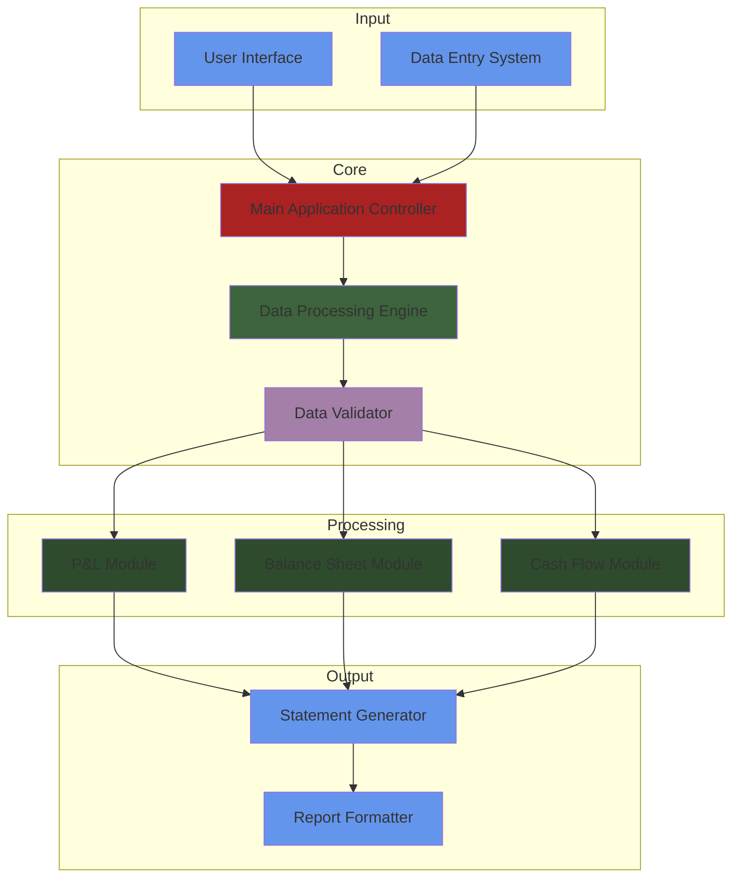

# 3-statement_model
Generate your P&amp;L statement, Balance sheet and Cash Flow statement just by entering your entries in any order

```mermaid
flowchart TB
    subgraph Input
        UI[User Interface]:::input
        DE[Data Entry System]:::input
    end

    subgraph Core
        MAC[Main Application Controller]:::controller
        DPE[Data Processing Engine]:::processor
        DV[Data Validator]:::utility
    end

    subgraph Processing
        PLM[P&L Module]:::module
        BSM[Balance Sheet Module]:::module
        CFM[Cash Flow Module]:::module
    end

    subgraph Output
        SG[Statement Generator]:::output
        RF[Report Formatter]:::output
    end

    UI --> MAC
    DE --> MAC
    MAC --> DPE
    DPE --> DV
    DV --> PLM
    DV --> BSM
    DV --> CFM
    PLM --> SG
    BSM --> SG
    CFM --> SG
    SG --> RF

    classDef input fill:#6495ED 
    classDef controller fill:#aa2222
    classDef processor fill:#3d643d
    classDef utility fill:#a47fa8
    classDef module fill:#2e4b2e
    classDef output fill:#6495ED

    click MAC "https://github.com/ArnavAgarwal-Mr-AR/3-statement_model/blob/main/app.py"
    click PLM "https://github.com/ArnavAgarwal-Mr-AR/3-statement_model/blob/main/pl_module.py"
    click BSM "https://github.com/ArnavAgarwal-Mr-AR/3-statement_model/blob/main/bs_module.py"
    click CFM "https://github.com/ArnavAgarwal-Mr-AR/3-statement_model/blob/main/cf_module.py"

```
