```mermaid
flowchart TB
    subgraph Input
        UI[User Interface]:::input
        DE[Data Entry System]:::input
    end

    subgraph Core
        MAC[Main Application Controller]:::controller
        DPE[Data Processing Engine]:::processor
        DV[Data Validator]:::utility
    end

    subgraph Processing
        PLM[P&L Module]:::module
        BSM[Balance Sheet Module]:::module
        CFM[Cash Flow Module]:::module
    end

    subgraph Output
        SG[Statement Generator]:::output
        RF[Report Formatter]:::output
    end

    UI --> MAC
    DE --> MAC
    MAC --> DPE
    DPE --> DV
    DV --> PLM
    DV --> BSM
    DV --> CFM
    PLM --> SG
    BSM --> SG
    CFM --> SG
    SG --> RF

    classDef input fill:#6495ED 
    classDef controller fill:#aa2222
    classDef processor fill:#3d643d
    classDef utility fill:#a47fa8
    classDef module fill:#2e4b2e
    classDef output fill:#6495ED

    click MAC "https://github.com/ArnavAgarwal-Mr-AR/3-statement_model/blob/main/app.py"
    click PLM "https://github.com/ArnavAgarwal-Mr-AR/3-statement_model/blob/main/pl_module.py"
    click BSM "https://github.com/ArnavAgarwal-Mr-AR/3-statement_model/blob/main/bs_module.py"
    click CFM "https://github.com/ArnavAgarwal-Mr-AR/3-statement_model/blob/main/cf_module.py"

```

# 3-Statement Financial Model

Welcome to the 3-Statement Financial Model repository. This project enables users to generate Profit & Loss (P&L) statements, Balance Sheets, and Cash Flow statements by entering financial entries in any order.

You can try the model [here](https://3statementmodel.streamlit.app/)

[](https://www.youtube.com/watch?v=EKssnE_8Wns&autoplay=1)


## Directory Structure

```
3-statement_model/
├── app.py             # Main application script
├── bs_module.py       # Balance Sheet module
├── cf_module.py       # Cash Flow statement module
├── pl_module.py       # Profit & Loss statement module
├── requirements.txt   # Python dependencies
└── README.md          # Project documentation
```
## Modules Overview

### 1. **app.py**
Serves as the main application script that integrates all modules and manages the workflow of generating financial statements.

### 2. **bs_module.py**
Handles the creation and management of the Balance Sheet, ensuring accurate representation of assets, liabilities, and equity.

### 3. **cf_module.py**
Manages the Cash Flow statement, detailing the inflows and outflows of cash to provide insights into the company's liquidity.

### 4. **pl_module.py**
Generates the Profit & Loss statement, summarizing revenues, costs, and expenses to illustrate the company's profitability.

## Features
- **Dynamic Entry Processing**: Input financial entries in any order; the application will organize and generate the corresponding financial statements.
- **Modular Design**: Each financial statement is managed by a dedicated module, promoting maintainability and scalability.
- **User-Friendly Interface**: Simplified data entry process for efficient statement generation.

## Contributing
Contributions are welcome! To contribute:
1. Fork the repository.
2. Create a new branch (`feature/your-feature-name`).
3. Commit your changes (`git commit -m 'Add new feature'`).
4. Push to the branch (`git push origin feature/your-feature-name`).
5. Open a Pull Request.

## License
This project is licensed under the MIT License. See the [LICENSE](LICENSE) file for details.

## Contact me 📪
<div id="badges">
  <a href="https://www.linkedin.com/in/arnav-agarwal-571a59243/" target="blank">
   
  </a>
 <a href="https://www.instagram.com/arnav_executes?igsh=MWUxaWlkanZob2lqeA==" target="blank">
 
 </a>
 </a>
 <a href="https://medium.com/@arumynameis" target="blank">
 
 </a>
</div>
